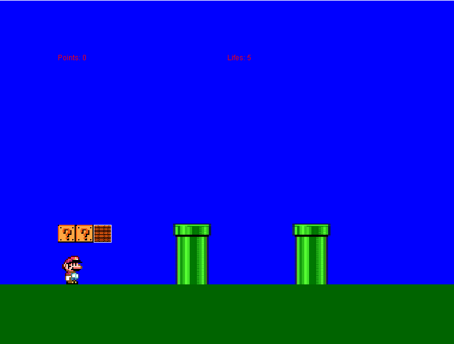
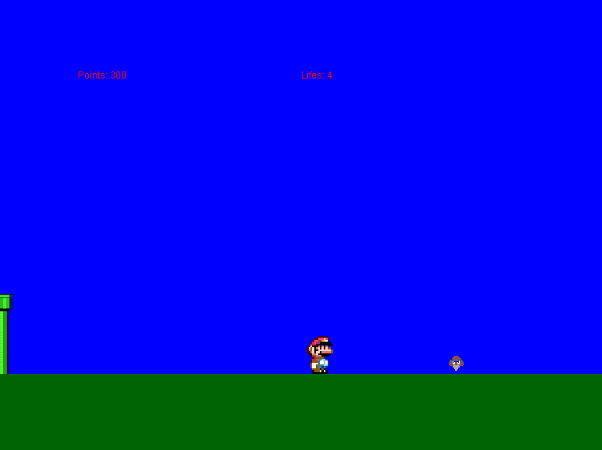
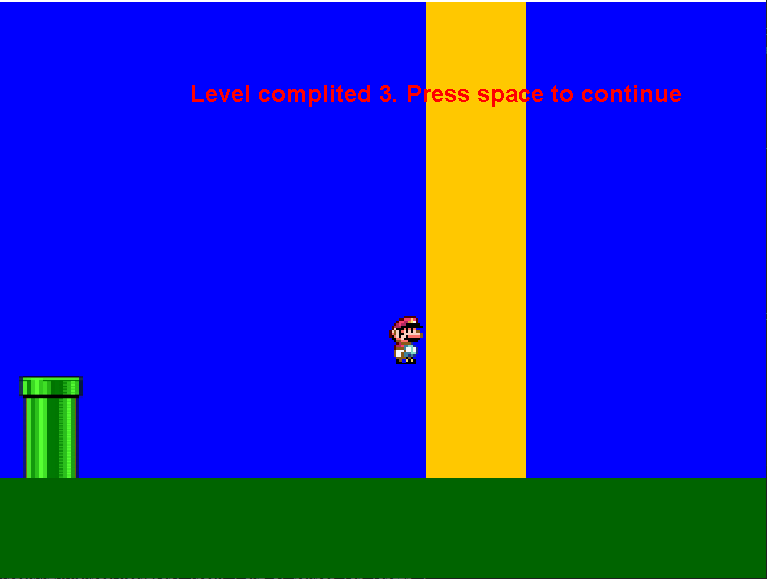

# 🕹️ Java 2D Platformer Game

This is a Mario-style 2D platformer built in Java using Swing. The game features classic enemies, level progression, basic physics (jumping, gravity), and interactive elements like coins and blocks.

---

## 🎮 Features

- ✅ 3 Levels with different layouts
- 🧱 Breakable brick blocks
- ❓ Question mark blocks that spawn coins
- 🪙 Collectible coins (increase score)
- 👾 Goombas (simple walking enemies)
- 🐢 Shellcreepers (turtle-like enemies that can be kicked)
- ❤️ Lives system (Game Over if lives = 0)
- 🎯 End-of-level goal
- 📷 Side-scrolling camera
- ⌨️ Keyboard controls (wasd + space)

---

## 📸 Screenshots

### Start of new run  

### In-Game  

### End of a level 

---

## 🧠 How It Works

- The game uses a **custom game loop** running at 60 FPS (`GamePanel` class).
- Graphics are rendered using **Java 2D API** (`Graphics2D`).
- Collision detection is done with `Rectangle` objects.
- Level elements (blocks, enemies, goals) are stored in lists and updated each frame.

---

## 🕹️ Controls

| Key       | Action         |
|-----------|----------------|
| a / d     | Move Left / Right |
| w         | Jump           |
| Space     | Continue to next level / Restart after death |

---

## 🛠️ Technologies

- Java (Swing / AWT)
- Object-Oriented Design
- Custom Sprite Loading
- Collision Detection
- State Management (Levels, Enemies, Player)

---
